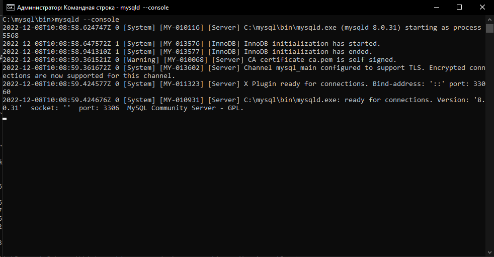
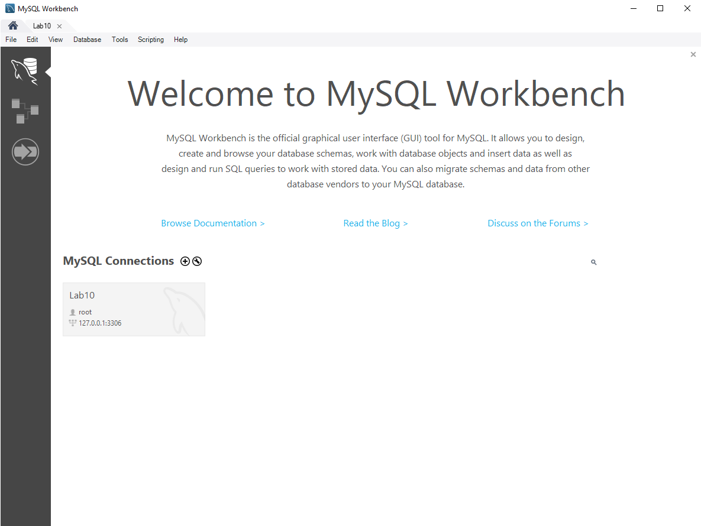
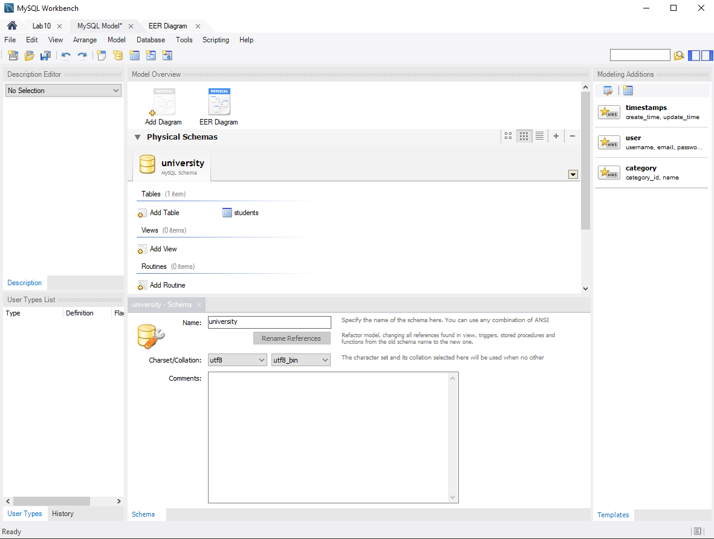
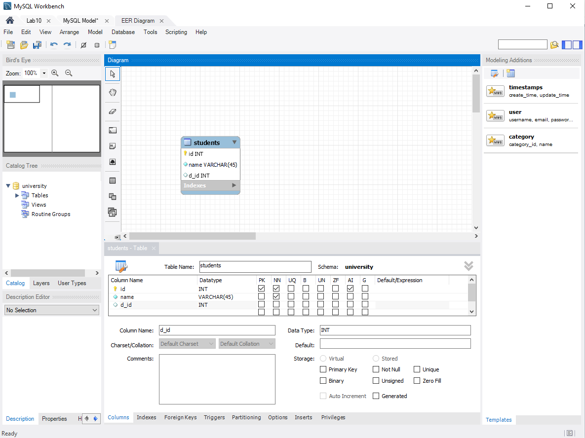
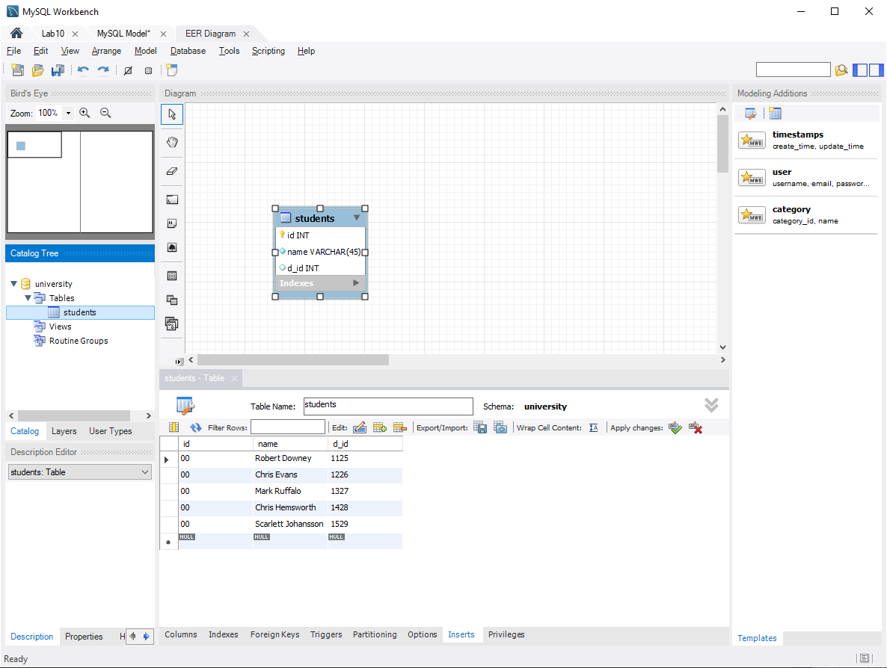
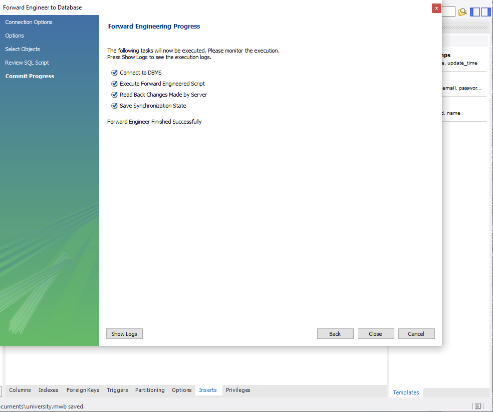
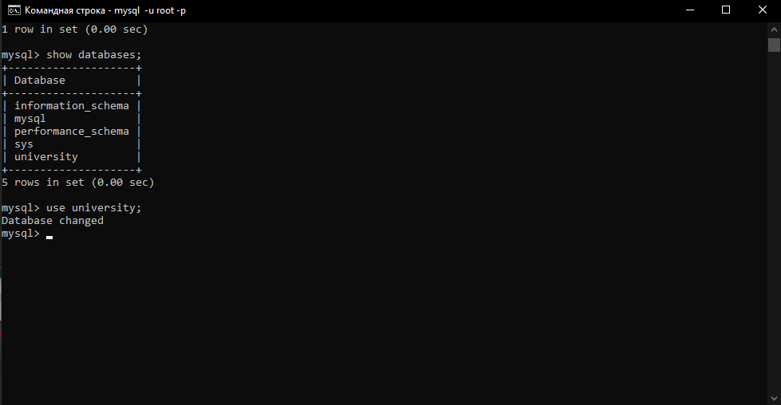
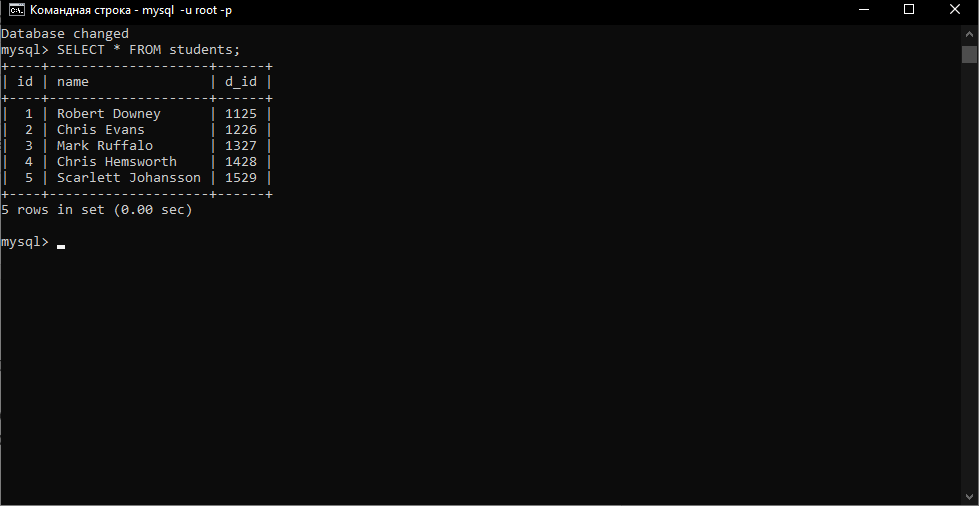
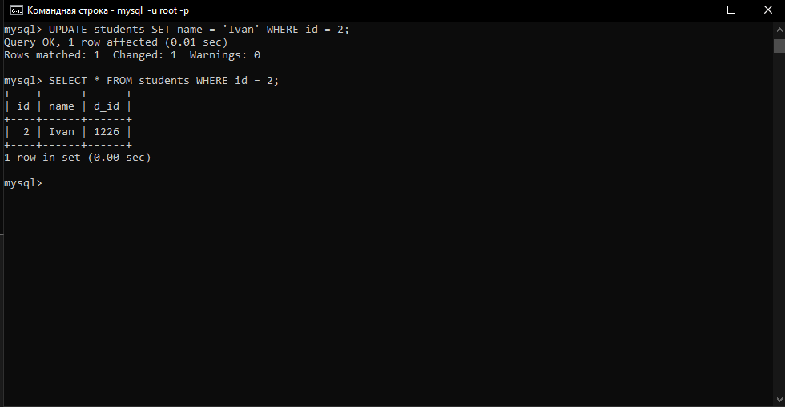
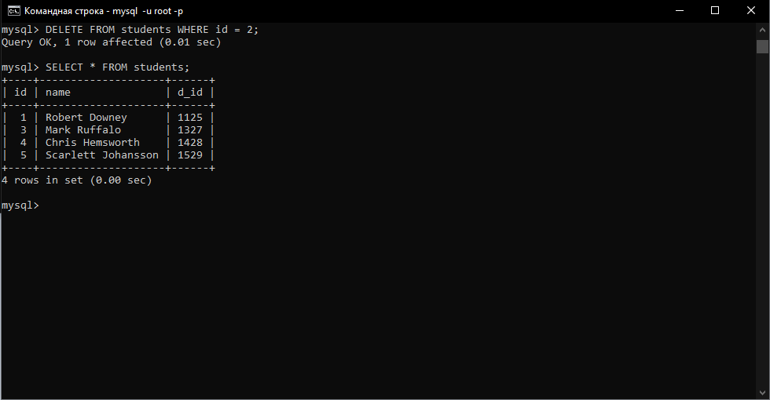

<h2 style="text-align: center; margin-top: 100px;font-size:40px">Лабораторная работа №10</h2>
<h2 style="text-align: center; margin-top:10px">«Базы данных»</h2>
<h3 style="text-align: right; margin-top:400px">Выполнил студент 3 курса   Чагочкин Никита</h3>
<h3 style="text-align: center; margin-top:40px">Южно-Сахалинск  2022 г. </h3>

- - -
# Решение:
## Я установил MySql Сервер и запустил его с помощью команды:
    mysqld --console

## Затем я скачал и установил MySQL WORKBENCH и добавил подключение к серверу

## Создал базу данных university

## В этой базе данных создал таблицу students с полями:
- id(int)
- name(varchar)
- d_id(int)

## Добавил в таблицу students несколько записей

## И экспортировал базу данных на MySql server

## В CMD открыл консоль сервера командой:
    mysql -u root -p 
## Далее в консоли mysql вывел доступные базы данных командой 
    show databases;
## И выбрал базу данных university, командой
    use university;

## Вывел данные из таблицы students командой:
    SELECT * FROM students;

## Изменил Name в записи с индексом 2 и вывел эту запись на экран с помощью команд:
    UPDATE students SET name = 'Ivan' WHERE id = 2;
    SELECT * FROM students WHERE id = 2;

## Удалил запись и индексом 2 и вывел содержимое таблицы командами:
    DELETE FROM students WHERE id = 2;
    SELECT * FROM students;

